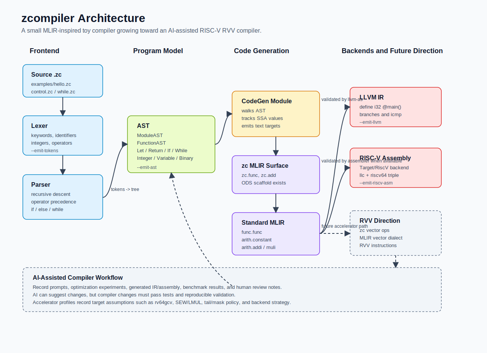

# zcompiler

`zcompiler` is a long-term compiler project with one final ambition:

> Build an AI self made compiler based on RISCV RVV accelerator.

The first practical milestone is a small MLIR-based toy compiler that can compile
a tiny language into LLVM IR and then into RISC-V assembly. This toy compiler is
not the final product. It is the bootstrapping path for learning, validating the
architecture, and gradually adding RISC-V Vector Extension (RVV) oriented
optimization passes.

## Architecture Overview



The diagram shows the current end-to-end shape: `.zc` source enters the lexer, parser, and AST frontend; the AST then feeds both the MLIR generation path and the direct RISC-V/RVV reference code generator; generated artifacts are validated with MLIR tools, the RISC-V toolchain, CTest, and QEMU. Documentation, accelerator profiles, benchmarks, and AI workflow records form the control plane for future RVV and accelerator work.

## Long-Term Vision

The final system should become a compiler stack that combines:

- A small but extensible frontend language.
- MLIR dialects for high-level program representation.
- Lowering pipelines from custom dialects to standard MLIR dialects, LLVM
  dialect, LLVM IR, and RISC-V machine code.
- RISC-V RVV aware optimization passes.
- AI-assisted compiler construction, tuning, analysis, and optimization.
- Accelerator-oriented code generation for vector workloads.

## First Milestone

The first milestone is `toy-zc`, a minimal compiler inspired by MLIR's Toy
tutorial. It currently supports:

- Integer literals.
- Variables.
- Arithmetic expressions.
- Function definitions, parameters, and calls.
- Return statement.
- Straight-line assignment.
- `ptr<i32>` buffer parameters.
- Scalar indexed `load` / `store`.
- Target-independent `matrix_multiply c, a, b, rows, cols, inner;` syntax for row-major `i32` MMA v1.
- RVV-friendly `matrix_multiply_packed_b c, a, packed_b, rows, cols, inner;` syntax for column-packed `B`.
- Target-independent `vector_add` syntax, including validated `ptr<i8>`,
  `ptr<i16>`, `ptr<i32>`, and `ptr<i64>` unit-stride slices plus `ptr<i16>`
  `m2` and `m4` LMUL slices.
- Target-independent `vector_copy` syntax with validated `ptr<i8>`,
  `ptr<i32>`, and `ptr<i64>` unit-stride slices.
- Target-independent `vector_scale` syntax.
- Target-independent `vector_mul` syntax.
- Target-independent `vector_reduce_add` syntax.
- Target-independent compare/select syntax for signed and unsigned predicates,
  with validated `ptr<i8>`, `ptr<i32>`, and `ptr<i64>` `vector_select_gt`
  slices.
- Transient mask syntax for signed/unsigned compare predicates plus
  `vector_masked_add/sub/mul/store/load` and masked strided/indexed memory.
- Built-in `print_i32` statement for RISC-V terminal output.
- Masked MLIR vector lowering for vector tails.
- MLIR emission.
- Lowering to LLVM-compatible IR.
- RISC-V assembly generation through LLVM's RISC-V backend.
- Direct RVV reference assembly for vector add across the current typed-buffer subset.
- Direct RVV reference assembly for vector copy, vector scale, and vector
  multiply, including validated `i8/i64` unit-stride scale and multiply slices.
- Direct RVV reference assembly for vector reduce add.
- Direct RVV reference assembly for signed/unsigned compare-select, masked add/sub/mul, masked store, and masked load slices.
- Direct RVV reference assembly for strided/indexed i32 loads and stores,
  masked strided/indexed i32 loads and stores, logical mask composition, and
  signed i16-to-i32 widening add.
- Direct scalar RISC-V assembly for `matrix_multiply` with QEMU correctness validation.
- Direct RISC-V `matrix_pack_b` plus RVV assembly for packed-B matrix multiply using unit-stride vector dot products.
- Scalar-vs-vector benchmark metadata for vector add.
- Machine-readable RVV accelerator profile.
- Host-side and QEMU correctness harnesses for masked vector tails, strided/indexed loads and stores, i16 widening add, and packed-B matrix workflows.

Example target input:

```zc
func main() -> i32 {
  let x = 1 + 2 * 3;
  return x;
}
```

Expected first output path:

```text
source.zc
  -> AST
  -> zc MLIR dialect
  -> func / arith / scf MLIR dialects
  -> LLVM dialect
  -> LLVM IR
  -> RISC-V assembly
```

## Repository Documents

- [arch.md](arch.md): architecture design for the first toy compiler.
- [plan.md](plan.md): phased implementation plan and milestones.
- [docs/current-capabilities.md](docs/current-capabilities.md): current
  compiler capabilities, limits, and the most complex stable demo.

## Build Phase 1

This project uses the existing local LLVM/MLIR checkout and build:

```text
/home/zyz/mlir/llvm-project/
/home/zyz/mlir/build/
```

Configure and build:

```bash
cmake -G Ninja -S /home/zyz/zcomipler -B /home/zyz/zcomipler/build \
  -DMLIR_DIR=/home/zyz/mlir/build/lib/cmake/mlir \
  -DLLVM_DIR=/home/zyz/mlir/build/lib/cmake/llvm

cmake --build /home/zyz/zcomipler/build
```

Run the Phase 1 driver:

```bash
/home/zyz/zcomipler/build/tools/zc/zc --help
/home/zyz/zcomipler/build/tools/zc/zc /home/zyz/zcomipler/examples/hello.zc --emit-mlir
```

## Run Tests

```bash
ctest --test-dir /home/zyz/zcomipler/build --output-on-failure
```

Phase 2 adds the first lexer test:

```bash
/home/zyz/zcomipler/build/tools/zc/zc /home/zyz/zcomipler/examples/hello.zc --emit-tokens
```

Phase 3 adds the first parser and AST dump:

```bash
/home/zyz/zcomipler/build/tools/zc/zc /home/zyz/zcomipler/examples/hello.zc --emit-ast
```

Phases 4-7 add MLIR and LLVM IR emission:

```bash
/home/zyz/zcomipler/build/tools/zc/zc /home/zyz/zcomipler/examples/hello.zc --emit-mlir
/home/zyz/zcomipler/build/tools/zc/zc /home/zyz/zcomipler/examples/hello.zc --emit-zc-mlir
/home/zyz/zcomipler/build/tools/zc/zc /home/zyz/zcomipler/examples/hello.zc --emit-lowered-mlir
/home/zyz/zcomipler/build/tools/zc/zc /home/zyz/zcomipler/examples/hello.zc --emit-llvm
/home/zyz/zcomipler/build/tools/zc/zc /home/zyz/zcomipler/examples/hello.zc --emit-riscv-asm
```

Later phases add control-flow examples:

```bash
/home/zyz/zcomipler/build/tools/zc/zc /home/zyz/zcomipler/examples/control.zc --emit-ast
/home/zyz/zcomipler/build/tools/zc/zc /home/zyz/zcomipler/examples/while.zc --emit-llvm
```

Current RVV vector-kernel path:

```bash
/home/zyz/zcomipler/build/tools/zc/zc /home/zyz/zcomipler/examples/vector_add.zc --emit-ast
/home/zyz/zcomipler/build/tools/zc/zc /home/zyz/zcomipler/examples/vector_add.zc --emit-mlir
/home/zyz/zcomipler/build/tools/zc/zc /home/zyz/zcomipler/examples/vector_add.zc --emit-riscv-asm
/home/zyz/zcomipler/build/tools/zc/zc /home/zyz/zcomipler/examples/vector_copy.zc --emit-mlir
/home/zyz/zcomipler/build/tools/zc/zc /home/zyz/zcomipler/examples/vector_copy.zc --emit-riscv-asm
/home/zyz/zcomipler/build/tools/zc/zc /home/zyz/zcomipler/examples/vector_scale.zc --emit-mlir
/home/zyz/zcomipler/build/tools/zc/zc /home/zyz/zcomipler/examples/vector_scale.zc --emit-riscv-asm
/home/zyz/zcomipler/build/tools/zc/zc /home/zyz/zcomipler/examples/vector_mul.zc --emit-mlir
/home/zyz/zcomipler/build/tools/zc/zc /home/zyz/zcomipler/examples/vector_mul.zc --emit-riscv-asm
/home/zyz/zcomipler/build/tools/zc/zc /home/zyz/zcomipler/examples/vector_reduce_add.zc --emit-mlir
/home/zyz/zcomipler/build/tools/zc/zc /home/zyz/zcomipler/examples/vector_reduce_add.zc --emit-riscv-asm
/home/zyz/zcomipler/build/tools/zc/zc /home/zyz/zcomipler/examples/vector_select_lt.zc --emit-mlir
/home/zyz/zcomipler/build/tools/zc/zc /home/zyz/zcomipler/examples/vector_select_lt.zc --emit-riscv-asm
/home/zyz/zcomipler/build/tools/zc/zc /home/zyz/zcomipler/examples/vector_select_le.zc --emit-mlir
/home/zyz/zcomipler/build/tools/zc/zc /home/zyz/zcomipler/examples/vector_select_le.zc --emit-riscv-asm
/home/zyz/zcomipler/build/tools/zc/zc /home/zyz/zcomipler/examples/vector_select_gt.zc --emit-mlir
/home/zyz/zcomipler/build/tools/zc/zc /home/zyz/zcomipler/examples/vector_select_gt.zc --emit-riscv-asm
/home/zyz/zcomipler/build/tools/zc/zc /home/zyz/zcomipler/examples/vector_select_ge.zc --emit-mlir
/home/zyz/zcomipler/build/tools/zc/zc /home/zyz/zcomipler/examples/vector_select_ge.zc --emit-riscv-asm
/home/zyz/zcomipler/build/tools/zc/zc /home/zyz/zcomipler/examples/vector_select_eq.zc --emit-mlir
/home/zyz/zcomipler/build/tools/zc/zc /home/zyz/zcomipler/examples/vector_select_eq.zc --emit-riscv-asm
/home/zyz/zcomipler/build/tools/zc/zc /home/zyz/zcomipler/examples/vector_select_ne.zc --emit-mlir
/home/zyz/zcomipler/build/tools/zc/zc /home/zyz/zcomipler/examples/vector_select_ne.zc --emit-riscv-asm
/home/zyz/zcomipler/build/tools/zc/zc /home/zyz/zcomipler/examples/vector_select_ult.zc --emit-mlir
/home/zyz/zcomipler/build/tools/zc/zc /home/zyz/zcomipler/examples/vector_select_ult.zc --emit-riscv-asm
/home/zyz/zcomipler/build/tools/zc/zc /home/zyz/zcomipler/examples/vector_select_ule.zc --emit-mlir
/home/zyz/zcomipler/build/tools/zc/zc /home/zyz/zcomipler/examples/vector_select_ule.zc --emit-riscv-asm
/home/zyz/zcomipler/build/tools/zc/zc /home/zyz/zcomipler/examples/vector_select_ugt.zc --emit-mlir
/home/zyz/zcomipler/build/tools/zc/zc /home/zyz/zcomipler/examples/vector_select_ugt.zc --emit-riscv-asm
/home/zyz/zcomipler/build/tools/zc/zc /home/zyz/zcomipler/examples/vector_select_uge.zc --emit-mlir
/home/zyz/zcomipler/build/tools/zc/zc /home/zyz/zcomipler/examples/vector_select_uge.zc --emit-riscv-asm
/home/zyz/zcomipler/build/tools/zc/zc /home/zyz/zcomipler/examples/vector_masked_add_gt.zc --emit-ast
/home/zyz/zcomipler/build/tools/zc/zc /home/zyz/zcomipler/examples/vector_masked_add_gt.zc --emit-mlir
/home/zyz/zcomipler/build/tools/zc/zc /home/zyz/zcomipler/examples/vector_masked_add_gt.zc --emit-riscv-asm
/home/zyz/zcomipler/build/tools/zc/zc /home/zyz/zcomipler/examples/vector_masked_store_gt.zc --emit-riscv-asm
/home/zyz/zcomipler/build/tools/zc/zc /home/zyz/zcomipler/examples/vector_masked_load_gt.zc --emit-riscv-asm
/home/zyz/zcomipler/build/tools/zc/zc /home/zyz/zcomipler/examples/vector_add_i8.zc --emit-riscv-asm
/home/zyz/zcomipler/build/tools/zc/zc /home/zyz/zcomipler/examples/vector_add_i16_m4.zc --emit-riscv-asm
/home/zyz/zcomipler/build/tools/zc/zc /home/zyz/zcomipler/examples/vector_add_i64.zc --emit-riscv-asm
/home/zyz/zcomipler/build/tools/zc/zc /home/zyz/zcomipler/examples/vector_copy_i8.zc --emit-riscv-asm
/home/zyz/zcomipler/build/tools/zc/zc /home/zyz/zcomipler/examples/vector_copy_i64.zc --emit-riscv-asm
/home/zyz/zcomipler/build/tools/zc/zc /home/zyz/zcomipler/examples/vector_mul_i8.zc --emit-riscv-asm
/home/zyz/zcomipler/build/tools/zc/zc /home/zyz/zcomipler/examples/vector_mul_i64.zc --emit-riscv-asm
/home/zyz/zcomipler/build/tools/zc/zc /home/zyz/zcomipler/examples/vector_scale_i8.zc --emit-riscv-asm
/home/zyz/zcomipler/build/tools/zc/zc /home/zyz/zcomipler/examples/vector_scale_i64.zc --emit-riscv-asm
/home/zyz/zcomipler/build/tools/zc/zc /home/zyz/zcomipler/examples/vector_select_i8_gt.zc --emit-riscv-asm
/home/zyz/zcomipler/build/tools/zc/zc /home/zyz/zcomipler/examples/vector_select_i64_gt.zc --emit-riscv-asm
/home/zyz/zcomipler/build/tools/zc/zc /home/zyz/zcomipler/examples/vector_strided_store.zc --emit-riscv-asm
/home/zyz/zcomipler/build/tools/zc/zc /home/zyz/zcomipler/examples/vector_indexed_store.zc --emit-riscv-asm
/home/zyz/zcomipler/build/tools/zc/zc /home/zyz/zcomipler/examples/vector_masked_strided_load.zc --emit-riscv-asm
/home/zyz/zcomipler/build/tools/zc/zc /home/zyz/zcomipler/examples/vector_masked_indexed_load.zc --emit-riscv-asm
/home/zyz/zcomipler/build/tools/zc/zc /home/zyz/zcomipler/examples/vector_masked_strided_store.zc --emit-riscv-asm
/home/zyz/zcomipler/build/tools/zc/zc /home/zyz/zcomipler/examples/vector_masked_indexed_store.zc --emit-riscv-asm
/home/zyz/zcomipler/build/tools/zc/zc /home/zyz/zcomipler/examples/matrix_multiply.zc --emit-riscv-asm
/home/zyz/zcomipler/build/tools/zc/zc /home/zyz/zcomipler/examples/matrix_multiply_packed_b.zc --emit-riscv-asm
/home/zyz/zcomipler/build/tools/zc/zc /home/zyz/zcomipler/examples/complex_vector_pipeline.zc --emit-ast
/home/zyz/zcomipler/build/tools/zc/zc /home/zyz/zcomipler/examples/complex_vector_pipeline.zc --emit-mlir
/home/zyz/zcomipler/build/tools/zc/zc /home/zyz/zcomipler/examples/complex_vector_pipeline.zc --emit-riscv-asm
/home/zyz/zcomipler/build/tools/zc/zc /home/zyz/zcomipler/examples/print_i32.zc --emit-riscv-asm
/home/zyz/zcomipler/benchmarks/vector_add/run.sh
/home/zyz/zcomipler/scripts/check-rvv-toolchain.sh
/home/zyz/zcomipler/scripts/prepare-riscv-llvm-build.sh --dry-run
/home/zyz/zcomipler/scripts/probe-formal-rvv-lowering.sh
ctest --test-dir /home/zyz/zcomipler/build -R qemu-riscv64 --output-on-failure
```


Manual visible matrix-multiply QEMU demo:

```bash
cd /home/zyz/zcomipler
./build/tools/zc/zc examples/matrix_multiply.zc --emit-riscv-asm > /tmp/matrix_multiply.s
riscv64-linux-gnu-gcc -static -no-pie -march=rv64gcv -mabi=lp64d /tmp/matrix_multiply.s test/qemu/matrix_multiply_harness.c -o /tmp/matrix_multiply
/home/qemu/qemu/build-riscv64-user/qemu-riscv64 -cpu max /tmp/matrix_multiply
```

Expected output includes:

```text
matrix_multiply demo 2x3 * 3x2 = [58 64; 139 154]
```

Manual visible packed-B matrix-multiply QEMU demo:

```bash
cd /home/zyz/zcomipler
./build/tools/zc/zc examples/matrix_multiply_packed_b.zc --emit-riscv-asm > /tmp/matrix_multiply_packed_b.s
riscv64-linux-gnu-gcc -static -no-pie -march=rv64gcv -mabi=lp64d /tmp/matrix_multiply_packed_b.s test/qemu/matrix_multiply_packed_b_harness.c -o /tmp/matrix_multiply_packed_b
/home/qemu/qemu/build-riscv64-user/qemu-riscv64 -cpu max /tmp/matrix_multiply_packed_b
```

Expected output includes:

```text
matrix_multiply_packed_b demo 2x3 * 3x2 = [58 64; 139 154]
```

Planning documents for the accelerator direction:

- [docs/rvv.md](docs/rvv.md)
- [docs/rvv-1.0-compliance.md](docs/rvv-1.0-compliance.md)
- [docs/current-capabilities.md](docs/current-capabilities.md)
- [docs/accelerator-profile.md](docs/accelerator-profile.md)
- [docs/correctness-testing.md](docs/correctness-testing.md)
- [docs/ai-workflow.md](docs/ai-workflow.md)
- [docs/phase18-vector-syntax.md](docs/phase18-vector-syntax.md)
- [docs/phase31u-packed-b.md](docs/phase31u-packed-b.md)
- [docs/phase19-vector-mlir.md](docs/phase19-vector-mlir.md)
- [docs/phase20-rvv-lowering.md](docs/phase20-rvv-lowering.md)
- [docs/phase20c-formal-rvv-lowering.md](docs/phase20c-formal-rvv-lowering.md)
- [docs/phase25-vector-kernels.md](docs/phase25-vector-kernels.md)
- [docs/phase25c-vector-reduction.md](docs/phase25c-vector-reduction.md)
- [docs/phase26-rvv-toolchain.md](docs/phase26-rvv-toolchain.md)
- [docs/phase26b-riscv-llvm-build.md](docs/phase26b-riscv-llvm-build.md)
- [docs/phase28b-print-i32.md](docs/phase28b-print-i32.md)
- [docs/phase28c-qemu-rvv-execution.md](docs/phase28c-qemu-rvv-execution.md)
- [docs/phase29b-source-element-width-contract.md](docs/phase29b-source-element-width-contract.md)
- [docs/phase30a-vector-mul.md](docs/phase30a-vector-mul.md)
- [docs/phase30b-qemu-manifest.md](docs/phase30b-qemu-manifest.md)
- [docs/phase30c-qemu-kernel-descriptors.md](docs/phase30c-qemu-kernel-descriptors.md)
- [docs/phase30d-signed-i32-semantics.md](docs/phase30d-signed-i32-semantics.md)
- [docs/phase30e-i32-wrapping-semantics.md](docs/phase30e-i32-wrapping-semantics.md)
- [docs/phase30f-scalar-i32-wrapping.md](docs/phase30f-scalar-i32-wrapping.md)
- [docs/phase30g-qemu-harness-generator.md](docs/phase30g-qemu-harness-generator.md)
- [docs/phase30h-qemu-check-templates.md](docs/phase30h-qemu-check-templates.md)
- [docs/phase30i-vector-compare-select-design.md](docs/phase30i-vector-compare-select-design.md)
- [docs/phase30j-vector-select-gt.md](docs/phase30j-vector-select-gt.md)
- [docs/phase30k-vector-select-predicates.md](docs/phase30k-vector-select-predicates.md)
- [docs/phase30l-signed-select-predicates.md](docs/phase30l-signed-select-predicates.md)
- [docs/phase30m-unsigned-select-predicates.md](docs/phase30m-unsigned-select-predicates.md)
- [docs/phase30n-mask-architecture.md](docs/phase30n-mask-architecture.md)
- [docs/phase30o-masked-add.md](docs/phase30o-masked-add.md)
- [docs/phase30p-mask-predicates.md](docs/phase30p-mask-predicates.md)
- [docs/phase30q-masked-arithmetic.md](docs/phase30q-masked-arithmetic.md)
- [docs/phase30r-masked-store.md](docs/phase30r-masked-store.md)
- [docs/phase30s-masked-load.md](docs/phase30s-masked-load.md)
- [docs/phase31t-mma.md](docs/phase31t-mma.md)
