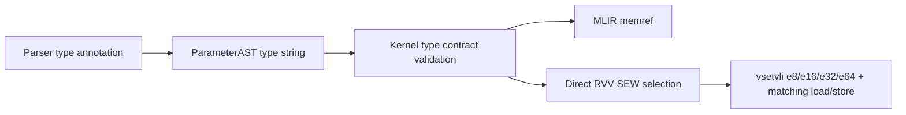

# Phase 29B: Source Element-Width Contract

## Goal

Define how the source language will expose RVV element widths before adding
`i8`, `i16`, and `i64` implementations. This is a contract phase: it keeps the
current compiler behavior at `i32`, but fixes the architecture direction so the
next implementation steps are not ad hoc.

## Decision

Use typed buffers first.

The source operation names stay width-neutral:

```zc
vector_add c, a, b, n;
vector_mul c, a, b, n;
vector_select_gt out, lhs, rhs, true_values, false_values, n;
```

The element width comes from buffer pointee types:

```zc
func add_i16(a: ptr<i16>, b: ptr<i16>, c: ptr<i16>, n: i32) -> i32 {
  vector_add c, a, b, n;
  return 0;
}
```

This avoids creating a separate keyword family such as `vector_add_i16` and
keeps the AST operation independent from the target backend.

## Type Contract

Planned source scalar and buffer types:

| Source type | RVV SEW | Unit-stride load/store | Notes |
| --- | --- | --- | --- |
| `i8` | `e8` | `vle8.v` / `vse8.v` | signed arithmetic contract must be explicit |
| `i16` | `e16` | `vle16.v` / `vse16.v` | signed arithmetic contract must be explicit |
| `i32` | `e32` | `vle32.v` / `vse32.v` | current implemented path |
| `i64` | `e64` | `vle64.v` / `vse64.v` | requires scalar ABI/result decisions |

The length operand remains an element count, not a byte count.

## Architecture



The parser should only know source types. A later validation/lowering layer
should reject mixed-width operands for a kernel unless the operation explicitly
supports widening or narrowing.

## Acceptance For Future SEW Implementations

A new element width is supported only when all of these exist:

- lexer/parser type support and AST dump coverage
- source example using typed buffers
- MLIR generation with the matching element type
- direct RVV assembly with matching `vsetvli` SEW and load/store width
- objdump checks
- QEMU runtime correctness tests
- compliance matrix and profile updates

## Current Status

Current implementation remains `i32` only. This phase records the contract and
updates the profile so later implementation phases can add widths one at a time.
