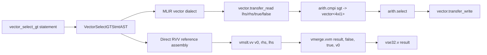

# Phase 30I: Vector Compare/Select Design

## Goal

Introduce the first source-level RVV predicate operation without widening the
whole language at once. The planned kernel is deliberately small: signed i32
vector compare greater-than followed by vector select.

## Source Syntax

Planned source form:

```zc
vector_select_gt out, lhs, rhs, true_values, false_values, n;
```

Semantics for each active lane `i` in `[0, n)`:

```text
out[i] = lhs[i] > rhs[i] ? true_values[i] : false_values[i]
```

Phase 30I keeps the current RVV subset constraints:

- element type: signed `i32`
- memory form: unit-stride buffers
- RVV setting: `e32, m1, ta, ma`
- length: dynamic `vsetvli` loop from remaining element count

## Architecture



The source AST should describe intent and stay independent from RVV register
choices. The direct RVV backend owns the `v0` mask convention because RVV mask
operations require the architectural mask register.

## RVV Instruction Mapping

For `lhs[i] > rhs[i]`, the direct backend should emit the RVV1.0 legal form:

```asm
vmslt.vv v0, rhs_vector, lhs_vector
vmerge.vvm result_vector, false_vector, true_vector, v0
```

Using `vmslt.vv rhs,lhs` avoids relying on non-portable greater-than pseudo
forms. `vmerge.vvm` then selects `true_vector` when the mask lane is true and
`false_vector` otherwise.

## Test Strategy

Implementation should add all of the following before the feature is considered
supported:

- lexer golden tokens for `vector_select_gt`
- parser AST golden output with all five buffers and the length expression
- MLIR golden output containing `arith.cmpi sgt` and `arith.select`
- direct RVV golden output containing `vmslt.vv` and `vmerge.vvm`
- objdump checks for the RVV instruction families
- QEMU runtime checks across the existing tail-length matrix

## Acceptance

The feature can move from planned to supported when the compliance matrix, active
profile, codegen tests, and QEMU manifest all list `vector_select_gt`.
